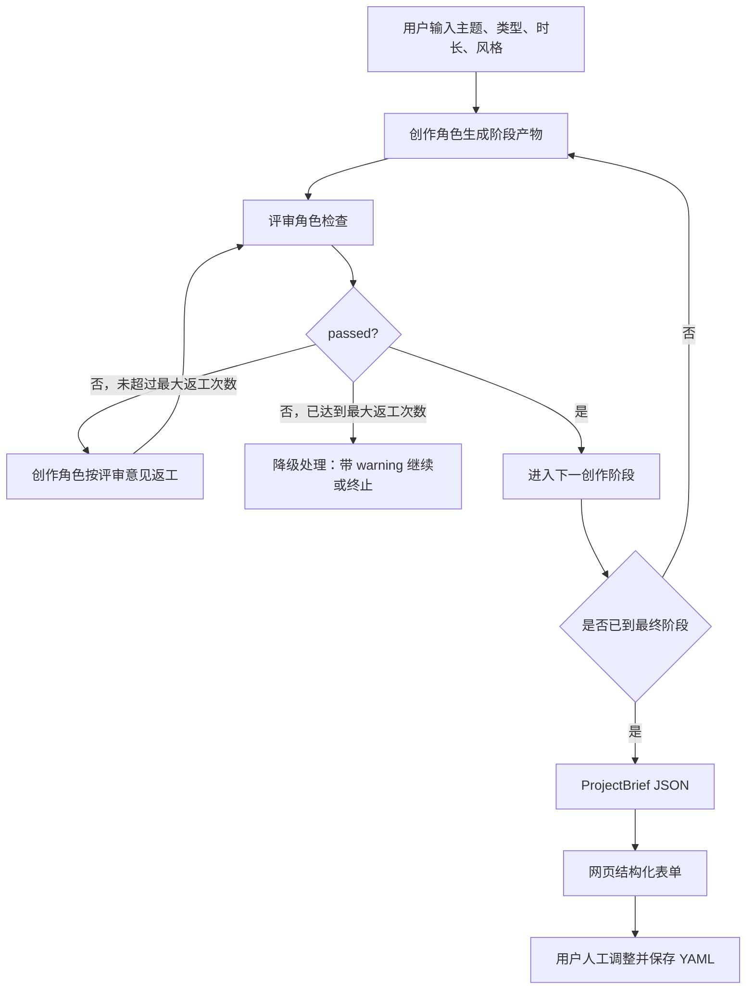
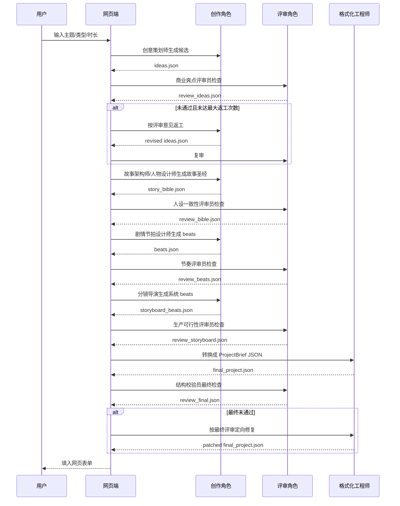

# AI 写剧本流程优化方案

本文档只针对网页端“AI 生成剧本”能力，不包含“导入已有剧本”的规范化流程。

## 目标

早期 AI 写剧本是一次性调用文本模型，让模型直接输出完整 `ProjectBrief JSON`。这种方式速度快，但容易出现几个问题：

- 故事设定单薄，只有大纲，没有足够戏剧冲突。
- 人物动机和人物关系不够稳定。
- 每幕之间承接弱，像流水账。
- 台词、动作、反转经常同时写得太粗。
- 模型一旦跑偏，后续分镜和视频生成都会跟着跑偏。

当前实现目标是把一次生成拆成多次“角色化”的文本模型调用。每次调用都扮演一个明确角色，例如创意策划师、人物设计师、分镜导演、评审员。每个创作角色完成后，都必须经过对应评审角色检查；评审通过才进入下一阶段，不通过则把评审意见交回创作角色返工，并设置最大返工次数防止无限循环。

## 总体思路

用“多角色协作 + 评审门禁 + 分层生成 + 结构化落盘”的方式替代一次性生成。



## 多角色协作框架

每个角色本质上都是一次文本模型调用，但提示词、输入材料、输出结构和成功标准不同。

### 角色清单

| 角色 | 类型 | 主要任务 | 典型输出 |
| --- | --- | --- | --- |
| 创意策划师 | 创作 | 根据主题生成多个候选故事方向 | `ideas.json` |
| 商业爽点评审员 | 评审 | 判断候选是否适合短剧/漫剧，有没有强钩子和反转 | `review_ideas.json` |
| 故事架构师 | 创作 | 选定方案后搭建主线、冲突、反转和结尾钩子 | `story_spine.json` |
| 人物关系设计师 | 创作 | 设计角色目标、秘密、冲突关系、视觉锁定 | `story_bible.json` |
| 人设一致性评审员 | 评审 | 检查角色是否有用、是否过多、动机是否清晰 | `review_bible.json` |
| 剧情节拍设计师 | 创作 | 拆成 5-6 个短视频节拍 | `beats.json` |
| 节奏评审员 | 评审 | 检查开场钩子、升级、反转、结尾是否成立 | `review_beats.json` |
| 短剧编剧 | 创作 | 把节拍扩写成动作和短台词 | `script.json` |
| 台词评审员 | 评审 | 检查台词是否短、是否口语化、是否推动剧情 | `review_script.json` |
| 分镜导演 | 创作 | 把剧本改写为每幕两个镜头 | `storyboard_beats.json` |
| 生产可行性评审员 | 评审 | 检查镜头是否可画、可视频化、角色/场景引用是否有效 | `review_storyboard.json` |
| 格式化工程师 | 创作 | 转成当前系统的 `ProjectBrief JSON` | `final_project.json` |
| 结构校验员 | 评审 | 校验 JSON schema、字段引用、时长、音色占位等 | `review_final.json` |

### 评审门禁规则

每个创作阶段都使用同一套门禁：

1. 创作角色生成阶段产物。
2. 评审角色读取产物和上游约束。
3. 评审角色只输出结构化评审结果，不重写正文。
4. 如果 `passed=true`，进入下一阶段。
5. 如果 `passed=false`，把 `issues` 和 `revision_brief` 交回同一个创作角色返工。
6. 每个阶段最多返工 `max_revision_attempts` 次。
7. 达到最大返工次数仍未通过时，根据严重程度处理：
   - 有 `critical` 问题：终止生成，给用户显示失败原因。
   - 只有 `high` / `medium` 问题：带 warning 进入下一阶段，保留日志，允许用户手动修改。

默认返工次数建议：

| 模式 | `max_revision_attempts` | 适用场景 |
| --- | ---: | --- |
| 快速模式 | 1 | 快速试想法，接受粗糙结果 |
| 标准模式 | 2 | 默认网页生成 |
| 严格模式 | 3 | 更重视剧本质量，愿意多等 |

### 统一评审输出格式

所有评审角色必须输出相同结构，方便代码统一处理。

```json
{
  "passed": false,
  "score": 72,
  "severity": "high",
  "summary": "整体评价",
  "issues": [
    {
      "id": "issue_1",
      "severity": "high",
      "field": "beats[2].turning_point",
      "problem": "这一幕没有真正发生剧情变化",
      "fix_instruction": "让主角在这一幕发现能改变局势的新证据"
    }
  ],
  "revision_brief": "请只修改第 3 幕，让它产生明确反转，不要新增角色。",
  "must_keep": ["保留主角冷静反击的爽点"],
  "must_not_change": ["不要改变主角身份", "不要增加新场景"]
}
```

字段说明：

- `passed`：是否通过，必须是布尔值。
- `score`：0-100，标准模式建议 80 分以上通过。
- `severity`：最高问题级别，取 `none`、`low`、`medium`、`high`、`critical`。
- `issues`：明确到字段或段落的问题列表。
- `revision_brief`：给创作角色的返工指令。
- `must_keep`：返工时必须保留的内容。
- `must_not_change`：返工时不能改动的内容。

### 统一返工输入格式

返工时不要让创作角色重新自由发挥，而是给它明确边界。

```json
{
  "role": "剧情节拍设计师",
  "attempt": 2,
  "max_revision_attempts": 2,
  "original_input": {},
  "previous_output": {},
  "review": {},
  "rewrite_rules": [
    "只修 review.issues 指出的字段",
    "必须保留 review.must_keep",
    "不得改动 review.must_not_change",
    "输出结构必须和 previous_output 完全一致"
  ]
}
```

## 调度伪代码

```python
def run_stage(writer_role, reviewer_role, input_payload, max_revision_attempts=2):
    artifact = call_model(writer_role, input_payload)
    for attempt in range(max_revision_attempts + 1):
        review = call_model(reviewer_role, {
            "input": input_payload,
            "artifact": artifact,
            "attempt": attempt,
        })
        save_artifact(writer_role, attempt, artifact, review)
        if review["passed"]:
            return artifact, review
        if attempt >= max_revision_attempts:
            return handle_review_failure(artifact, review)
        artifact = call_model(writer_role, {
            "original_input": input_payload,
            "previous_output": artifact,
            "review": review,
            "attempt": attempt + 1,
        })
```

## 阶段设计

### 0. 用户输入

网页端增加或明确以下输入项：

- 主题：用户一句话想法。
- 类型：例如古风悬疑、校园爽剧、都市复仇。
- 目标时长：例如 60 秒。
- 风格：国漫、短剧爽感、悬疑压迫、轻喜等。
- 主角倾向：可选，男主/女主/群像/未指定。
- 禁止内容：可选，例如不要玄幻、不要血腥、不要恋爱线。
- 结尾类型：可选，反转、悬念、爽点收束、续集钩子。

这些输入会形成一个 `StoryRequest`，作为后续所有模型调用的共同约束。

## 多角色调用方案

### 1. 创意扩展

目的：根据用户主题生成多个候选故事方向，不直接写完整剧本。

创作角色：创意策划师。

评审角色：商业爽点评审员。

返工规则：如果候选故事缺少主角目标、冲突、反转或短剧爽点，商业爽点评审员返回 `passed=false`，创意策划师重新生成候选；最多返工 2 次。

输入：

- `StoryRequest`

输出：

```json
{
  "candidates": [
    {
      "id": "idea_1",
      "title": "候选标题",
      "logline": "一句话故事",
      "core_conflict": "核心冲突",
      "hook": "前三秒钩子",
      "reversal": "主要反转",
      "ending_hook": "结尾钩子",
      "risk": "可能的问题"
    }
  ]
}
```

建议生成 3 个候选，不超过 5 个。

约束：

- 每个候选必须有明确主角、目标、阻碍、反转。
- 每个候选必须适合目标时长。
- 不能展开成长篇设定。

### 2. 方案筛选

目的：让模型扮演审稿人，从候选中选一个最适合短漫剧自动生成的方向。

执行角色：商业爽点评审员。

复核角色：总评审员。

返工规则：如果所有候选都不适合，返回 `passed=false`，要求创意策划师重新生成候选；如果候选可用但有缺陷，输出 `revision_notes` 交给后续故事架构师修正。

输入：

- `StoryRequest`
- 第 1 步候选列表

输出：

```json
{
  "selected_id": "idea_2",
  "reason": "选择原因",
  "must_keep": ["必须保留的爽点或钩子"],
  "must_avoid": ["后续写作必须避免的问题"],
  "revision_notes": ["需要增强的地方"]
}
```

约束：

- 选择标准不是文学性最高，而是最适合 60 秒漫剧样片。
- 优先选择画面感强、冲突清晰、角色少、结尾有钩子的方案。

### 3. 故事圣经

目的：锁定世界观、人物、场景和核心规则，防止后续剧情漂移。

创作角色：故事架构师 + 人物关系设计师。

评审角色：人设一致性评审员。

返工规则：如果角色动机不清、角色过多、场景过多、视觉锁定不可用，评审员返回 `passed=false`，人物关系设计师只修 `characters`、`locations`、`rules`；最多返工 2 次。

输入：

- `StoryRequest`
- 选中的候选方案
- 筛选阶段的 `must_keep` / `must_avoid`

输出：

```json
{
  "title": "剧名",
  "genre": "类型",
  "logline": "一句话故事",
  "tone": "节奏和情绪要求",
  "visual_style": "固定画风",
  "characters": [
    {
      "id": "protagonist",
      "name": "角色名",
      "role": "主角",
      "goal": "本集目标",
      "secret": "隐藏信息",
      "appearance": "外貌设定",
      "personality": "性格",
      "gender": "female",
      "voice_direction": "声音方向",
      "visual_lock": ["固定发型", "固定服装", "固定道具"]
    }
  ],
  "locations": [
    {
      "id": "main_location",
      "name": "场景名",
      "description": "场景描述",
      "visual_lock": ["固定元素"]
    }
  ],
  "rules": ["世界规则或剧情规则"]
}
```

约束：

- 角色数量默认 2-4 个。
- 场景数量默认 1-3 个。
- 每个角色必须有本集功能，不能只是背景人物。
- 视觉锁定必须可用于图片生成。

### 4. 剧情节拍

目的：先写结构，不写长对白。把故事拆成适合短视频节奏的 beats。

创作角色：剧情节拍设计师。

评审角色：节奏评审员。

返工规则：如果缺少开场钩子、冲突升级、反转或结尾钩子，节奏评审员返回 `passed=false`，剧情节拍设计师只重写问题 beats；最多返工 2 次。

输入：

- `StoryRequest`
- 故事圣经

输出：

```json
{
  "beats": [
    {
      "id": "hook",
      "duration_sec": 8,
      "summary": "本幕发生什么",
      "dramatic_function": "钩子/升级/反转/悬念",
      "emotion": "压迫",
      "location_id": "main_location",
      "characters": ["protagonist", "opponent"],
      "must_show": "必须出现的画面信息",
      "turning_point": "这一幕的变化"
    }
  ]
}
```

建议结构：

- 60 秒：5-6 个 beats。
- 每个 beat 后续拆成 1-2 个镜头。
- 第一幕必须在 3-5 秒内给出冲突。
- 倒数第二幕给反转。
- 最后一幕给情绪释放或续集钩子。

### 5. 单集短剧稿

目的：把节拍扩写成可读剧本，包括动作和台词，但仍不直接进入最终格式。

创作角色：短剧编剧。

评审角色：台词评审员。

返工规则：如果台词太长、解释过多、不像角色说的话，台词评审员返回 `passed=false`，短剧编剧只修对应 beat 的动作和台词；最多返工 2 次。

输入：

- 故事圣经
- 剧情节拍

输出：

```json
{
  "script": [
    {
      "beat_id": "hook",
      "action": "动作描述",
      "dialogue": [
        {
          "speaker": "旁白",
          "text": "台词"
        }
      ],
      "subtext": "潜台词或情绪"
    }
  ]
}
```

约束：

- 台词短，适合字幕。
- 台词不能解释所有设定，要靠动作和反应推进。
- 每个 beat 至少有一个可视化动作。
- 不新增故事圣经之外的重要角色。

### 6. 分镜化改写

目的：把单集短剧稿转成当前系统可用的 `beats` 字段，每幕拆成两个镜头。

创作角色：分镜导演。

评审角色：生产可行性评审员。

返工规则：如果镜头动作不可视化、单镜头信息过多、角色/场景引用无效，生产可行性评审员返回 `passed=false`，分镜导演只修对应镜头；最多返工 2 次。

输入：

- 故事圣经
- 剧情节拍
- 单集短剧稿

输出接近当前 `ProjectBrief.beats`：

```json
{
  "beats": [
    {
      "id": "hook",
      "summary": "剧情摘要",
      "emotion": "压迫",
      "location_id": "main_location",
      "characters": ["protagonist", "opponent"],
      "action_first": "镜头 1 动作",
      "dialogue_first": "旁白：...",
      "production_mode_first": "image_to_video",
      "action_second": "镜头 2 动作",
      "dialogue_second": "角色名：...",
      "production_mode_second": "image_to_video"
    }
  ]
}
```

约束：

- 每个镜头只做一个主要动作。
- 台词格式必须是 `旁白：文本` 或 `角色名：文本`。
- 默认 `production_mode_*` 为 `image_to_video`。
- 镜头动作必须能转成图片提示词和视频提示词。

### 7. 综合约束检查

目的：不是生成新内容，而是由结构校验员检查当前 `ProjectBrief` 草稿是否满足系统生产要求。这是最终落入网页表单前的总门禁。

执行角色：结构校验员。

返工角色：格式化工程师，必要时回退到分镜导演。

返工规则：如果是字段缺失、字段格式、引用无效，由格式化工程师修复；如果是剧情或镜头本身问题，回退给分镜导演修复；最多返工 2 次。

输入：

- `StoryRequest`
- 故事圣经
- 分镜化 beats
- 当前 `ProjectBrief` 草稿

输出：

```json
{
  "passed": false,
  "issues": [
    {
      "severity": "high",
      "field": "beats[2].dialogue_first",
      "problem": "台词过长",
      "fix_instruction": "压缩到 24 个汉字以内"
    }
  ],
  "summary": "整体判断"
}
```

建议检查项：

- 是否符合用户主题和类型。
- 是否有明确开场钩子。
- 是否有冲突升级。
- 是否有反转或结尾钩子。
- 角色数量是否过多。
- 场景数量是否过多。
- 台词是否太长。
- 镜头动作是否可视化。
- 角色名是否和角色表一致。
- `location_id`、`characters` 是否引用有效。
- 总时长是否接近目标。

### 8. 定向修订

目的：只修评审员指出的问题，不重写全部内容。这个阶段不是固定的一次调用，而是所有阶段都可能触发的返工机制。

执行角色：原创作角色。

评审角色：原评审角色。

输入：

- 约束检查结果
- 原始 ProjectBrief 草稿

输出：

```json
{
  "patched_project": {}
}
```

规则：

- 最多修订 2 轮。
- 只改 `issues` 指出的字段。
- 不允许改掉故事圣经里的核心设定。
- 修订后再次进入“约束检查”。
- 如果达到最大返工次数仍未通过，必须记录 `warning` 和最后一次评审结果。

### 9. 最终 ProjectBrief JSON

目的：输出当前系统可直接保存的结构。

最终字段：

- `project_id`
- `title`
- `genre`
- `format`
- `aspect_ratio`
- `target_duration_sec`
- `audience`
- `logline`
- `visual_style`
- `tone`
- `characters`
- `locations`
- `beats`

生成完成后进入现有网页结构化表单，用户可以继续手动编辑、设置音色、保存 YAML。

## 推荐调用链

最小可行版：



推荐完整版：

1. 创意扩展
2. 方案筛选
3. 故事圣经
4. 剧情节拍
5. 单集短剧稿
6. 分镜化改写
7. 约束检查
8. 定向修订
9. 最终 ProjectBrief

## 模型槽位建议

当前配置可以先只用 `llm` 和 `llm_fast`。角色不一定需要不同模型，先通过不同 system prompt 区分职责。

- `llm`：负责创作角色，例如创意策划师、故事架构师、人物关系设计师、剧情节拍设计师、短剧编剧、分镜导演。
- `llm_fast`：负责评审和修复角色，例如商业爽点评审员、人设一致性评审员、节奏评审员、台词评审员、生产可行性评审员、结构校验员、格式化工程师。

如果后续要进一步优化，可以拆成：

- `writer_model`：创意和剧本。
- `critic_model`：检查和审稿。
- `formatter_model`：JSON 修复和字段补齐。

短期不建议引入太多模型槽位，先用现有 `llm` / `llm_fast` 就够。

## 保存和日志

每次 AI 写作建议保存中间产物：

```text
outputs/web_api/<project_id or temp_id>/
  00_request.json
  01_ideas/
    attempt_0_writer.json
    attempt_0_review.json
    attempt_1_writer.json
    attempt_1_review.json
  02_selection/
    attempt_0_review.json
  03_story_bible/
    attempt_0_writer.json
    attempt_0_review.json
  04_beats/
    attempt_0_writer.json
    attempt_0_review.json
  05_script/
    attempt_0_writer.json
    attempt_0_review.json
  06_storyboard_beats/
    attempt_0_writer.json
    attempt_0_review.json
  07_final_project/
    attempt_0_writer.json
    attempt_0_review.json
    final_project.json
  generation.log
```

这样用户可以看到到底是哪一步写坏了，也方便重新从某一步继续生成。

## 前端交互建议

网页端不要一次只显示一个“生成中”，建议显示阶段进度：

- 正在生成候选创意
- 正在评审候选创意
- 候选创意未通过，正在第 1 次返工
- 正在筛选最佳方案
- 正在锁定角色和场景
- 正在评审人物一致性
- 正在生成剧情节拍
- 正在评审节奏
- 正在生成短剧稿
- 正在评审台词
- 正在分镜化
- 正在评审生产可行性
- 正在执行最终结构校验
- 已达到最大返工次数，带 warning 进入人工编辑
- 已填入表单

用户可以选择：

- 快速模式：跳过单集短剧稿，每个阶段最多返工 1 次。
- 标准模式：完整角色链路，每个阶段最多返工 2 次。
- 严格模式：完整角色链路，每个阶段最多返工 3 次，并要求最终评分不低于 85。

## 与现有系统的衔接

现有系统最终仍然只需要一个 `ProjectBrief`。因此新流程不需要改后续图片、配音、视频和合成阶段。

需要改的是网页端 `/api/outline`：

- 当前：一次调用 `llm`，直接生成完整 project。
- 优化后：多次调用 `llm` / `llm_fast`，逐步生成中间结构，最终合并成 project。

现有 `ProjectBrief` schema 可以继续使用，只需要在中间产物里增加更丰富的临时字段，例如 `goal`、`secret`、`dramatic_function`、`must_show`，最终落盘时再转换成当前字段。

## 优先级建议

第一阶段先做标准模式：

1. 创意扩展
2. 商业爽点评审，不通过最多返工 2 次
3. 故事圣经
4. 人设一致性评审，不通过最多返工 2 次
5. 剧情节拍
6. 节奏评审，不通过最多返工 2 次
7. 分镜化 ProjectBrief
8. 生产可行性评审，不通过最多返工 2 次
9. 最终结构校验

暂时不做完整短剧稿，先解决“故事空、结构弱、人物漂移”的问题。

第二阶段再加：

- 单集短剧稿
- 多轮修订
- 用户可选择候选方案
- 中间产物可视化

这样实现风险更低，也更容易看出每一步对成片质量的提升。
